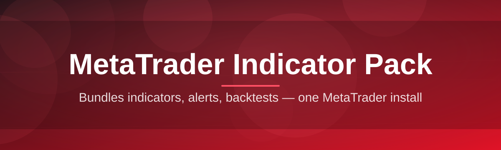
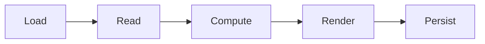

# mt-indicator-suite 📈🧭

  

*A chart co-pilot for MetaTrader — indicators that think in structure, not just squiggly lines.*

  

---

## 🔭 Overview

**mt-indicator-suite** is a curated, standalone MetaTrader Indicator Pack built for traders who are tired of stacking twelve overlapping oscillators just to figure out what the market is actually doing. Instead of another lagging moving-average clone, this pack focuses on *market structure, volatility compression, and session context* — the stuff that actually changes how you read a chart. Every indicator in the suite is written to be visually calm on purpose: fewer colors, clearer signals, and zero chart clutter.

This project exists because the default indicator ecosystem around MetaTrader is fragmented — dozens of single-purpose scripts scattered across forums, half of them undocumented, most of them abandoned. `mt-indicator-suite` consolidates the essentials into one pack with a consistent design language, consistent naming, and consistent settings behavior across every tool. Think of it less as "a folder of indicators" and more as a *toolbox with a house style*.

It's built for discretionary chart traders, systematic traders who prototype visually before coding an EA, and anyone doing technical analysis on MetaTrader who wants indicators that respect their screen real estate. No brokerage affiliation, no signal-selling, no black-box magic — just well-behaved chart tools you can inspect, tweak, and trust.

> [!NOTE]
> This is an indicator pack, not an Expert Advisor. It draws, measures, and highlights — it does not place trades on your behalf.

---

## 🧩 What's Inside the Toolbox

- **Structure Mapper** — automatically plots swing highs/lows and labels higher-high / lower-low sequences so market structure reads itself instead of you squinting at candles.

- **Volatility Squeeze Meter** — a compression-detection overlay that flags when average true range collapses below its rolling baseline, often the calm before a breakout.

- **Session Shading** — paints Asian, London, and New York sessions directly onto the chart background so time-of-day context is never a guessing game.

- **Confluence Ribbon** — a multi-timeframe trend ribbon that blends short and long directional bias into a single color-coded strip above price.

- **Liquidity Sweep Flag** — highlights candle wicks that punch through prior highs/lows and snap back, a classic footprint of stop-hunt style price action.

- **Adaptive Spread Monitor** — a lightweight panel tracking live spread against its historical average, useful for scalpers on variable-spread brokers.

- **Anchored VWAP Toolkit** — drop an anchor on any bar and get a running volume-weighted average price fan out from that point.

- **Noise-Filtered Momentum** — a smoothed momentum oscillator with configurable noise rejection so you're not reacting to every tick twitch.

> [!TIP]
> Every indicator ships with sane defaults. You can absolutely tune every parameter, but out-of-the-box settings are meant to be chart-ready on day one.

---

## 🚀 Getting Started

1. **Visit the landing page** using the download button on this page — that's the only official source for the pack.

2. **Download the installer package** for the current 2026 release.

3. **Run the installer** and point it at your MetaTrader data folder (auto-detected in most setups).

4. **Restart MetaTrader**, then drag any indicator from the Navigator panel onto a chart — you're live.

> [!IMPORTANT]
> Always restart the MetaTrader terminal after installation. Indicators loaded before install won't register in the Navigator until the terminal reinitializes its indicator cache.

---

## 🖥️ Requirements Matrix

| Component | Minimum | Recommended |
|---|---|---|
| **OS** | Windows 10 (64-bit) | Windows 11 (64-bit) |
| **RAM** | 4 GB | 8 GB+ |
| **Disk** | 250 MB free | 1 GB free (multi-chart setups) |

> [!WARNING]
> Running many indicator instances across dozens of charts simultaneously is RAM-hungry by nature of MetaTrader itself, not this pack. Close unused chart windows if your terminal feels sluggish.

---

## ⚙️ How It Works

The suite is architected as a set of self-contained compiled indicator modules that hook into MetaTrader's native chart-drawing and event pipeline — nothing runs outside the terminal, and nothing phones home.

1. **Load** — the indicator module attaches to a chart via the Navigator.

2. **Read** — it pulls OHLC, volume, and tick data directly from the terminal's local price feed.

3. **Compute** — internal logic (structure detection, volatility math, session windows) runs per-bar or per-tick depending on the tool.

4. **Render** — results are drawn as overlays, sub-window panels, or on-chart objects using native chart drawing calls.

5. **Persist** — your settings, colors, and template choices are saved per-chart so reopening MetaTrader restores your exact setup.

---

## 🩹 Troubleshooting

<strong>The indicator doesn't show up in the Navigator panel.</strong>

Restart the terminal completely (not just the chart). MetaTrader scans the indicators folder only at startup in most builds.

<strong>Colors look inverted or hard to read on a dark chart theme.</strong>

Open the indicator's Inputs tab and switch the palette preset from Light to Dark — every indicator in the pack ships both.

<strong>Session Shading is off by a few hours from my broker's actual session times.</strong>

Adjust the GMT offset input to match your broker server's time zone — brokers don't standardize this, so it's a manual one-time fix.

<strong>Structure Mapper labels feel too noisy on lower timeframes.</strong>

Increase the "swing sensitivity" parameter — lower timeframes generate more micro-swings, and the default is tuned for H1 and above.

<strong>Adaptive Spread Monitor shows zero or blank values.</strong>

Some brokers restrict spread data on certain symbols outside market hours. Try again once the symbol's market is active.

<strong>Anchored VWAP resets unexpectedly after a terminal restart.</strong>

Anchors are stored per-chart-template — save your chart as a template (Ctrl+Shift+T) if you want the anchor to persist across sessions.

---

## 🎨 UI / UX Notes

- **Themes** — Light, Dark, and "Contrast" high-visibility palette, switchable per indicator.

- **Keyboard shortcuts:**

  | Shortcut | Action |
  |---|---|
  | `Ctrl + I` | Open MetaTrader Indicators list |
  | `Ctrl + Shift + T` | Save current chart as template |
  | `Ctrl + Y` | Toggle grid lines (helps visually pair with Session Shading) |
  | `F8` | Open properties of the last selected indicator |

- **Settings persistence** — every parameter set is stored per chart template, so you can build a "scalping" template and a "swing" template with entirely different indicator configs.

- **Panel behavior** — sub-window indicators (like Noise-Filtered Momentum) auto-scale their vertical axis; overlays (like Confluence Ribbon) never resize your price axis.

  

---

## 🤝 Contributing & Community

Bug reports, feature ideas, and indicator suggestions are genuinely welcome — this pack grows from real trader feedback, not a roadmap written in isolation.

- Open an issue for bugs or requests.

- Discussions are the right place for "how do I configure X for Y strategy" questions.

- Pull requests are reviewed with an eye toward keeping the pack's visual consistency intact — a new indicator should feel like it belongs next to the others.

> [!NOTE]
> There's no formal roadmap vote system yet — the most detailed, well-argued issues tend to get prioritized first.

---

## 📄 License

Released under the [MIT License](LICENSE), 2026. Use it, fork it, build on top of it.

---

## ⚠️ Disclaimer

This project is provided for educational and analytical purposes. It does not constitute financial advice, and past chart behavior visualized by any indicator does not guarantee future results. Trading involves substantial risk — use your own judgment, and consider consulting a licensed financial professional before making trading decisions.

---

